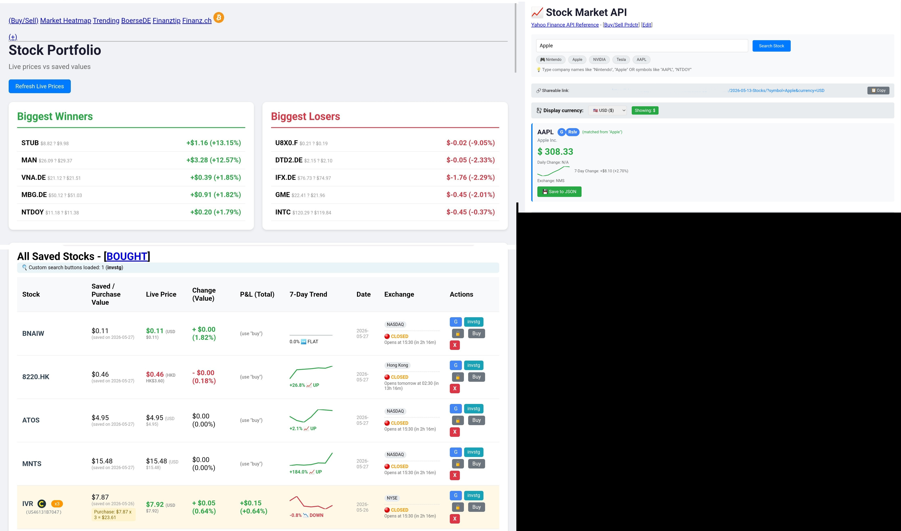

# 📈 Highly Noobish Stock Portfolio Manager

> **DISCLAIMER:** This tool does **not** serve as investing help or suggestion tool of any sort!  
> All data is for informational/educational purposes only. Use at your own risk.

## What is this?

A simple,  PHP/JS stock tracker that lets you:
- Add stocks to a watchlist
- View current trends + external ratings (via `searchengs.txt` + processors)
- Manage a **depot** (portfolio) – buy stocks, save ISINs to JSON
- Set recurring features per stock (quarterly, half‑yearly reports etc.) using `stockatttib.php`
- See main stock overview in `stockvalues.php`

## Basic Workflow

1. Add a stock (via UI or directly)
2. Check its trend + external ratings (fetched via `searchengs.txt` processors)
3. ""Buy"" stock → save to depot JSON via `buy.php`
4. Assign recurring flags and volatility ratings (quarterly/half‑yearly) in `stockatttib.php`
5. Watch everything in `stockvalues.php`

## Setup

1. Put all files in a PHP‑capable folder (XAMPP / LAMP / whatever)
2. Make sure JSON files are writable (`stocks.json`, `depot.json`, etc.)
3. Edit `searchengs.txt` if you want custom search processor scripts
4. Run `stockvalues.php` in your browser

## Disclaimer

**This is NOT investing advice or a suggestion tool of any sort!**

---

